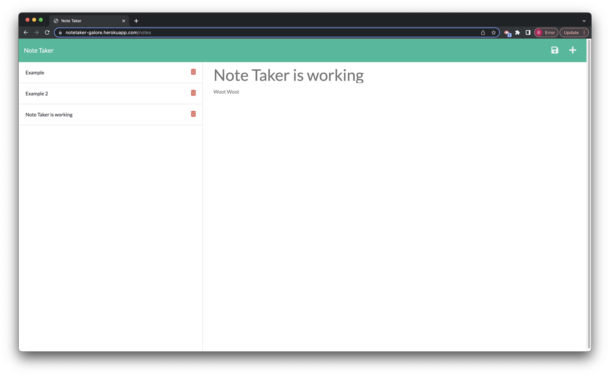

# Notetaker-Galore

## Objective

- Create a note taking application that can be used to write and save notes. - Express.js will be used for the back end and will save and retrieve note data from a JSON file.

## User Story

- AS A small business owner
- I WANT to be able to write and save notes
- SO THAT I can organize my thoughts and keep track of tasks I need to complete

## Results

- I was able to successfully create a note taking application that also fulfills the bonus of deleting a saved note if needed.

## Screenshot of Deployed Application

## Deployed Link

- Link to 

### Created by Brian Koo
